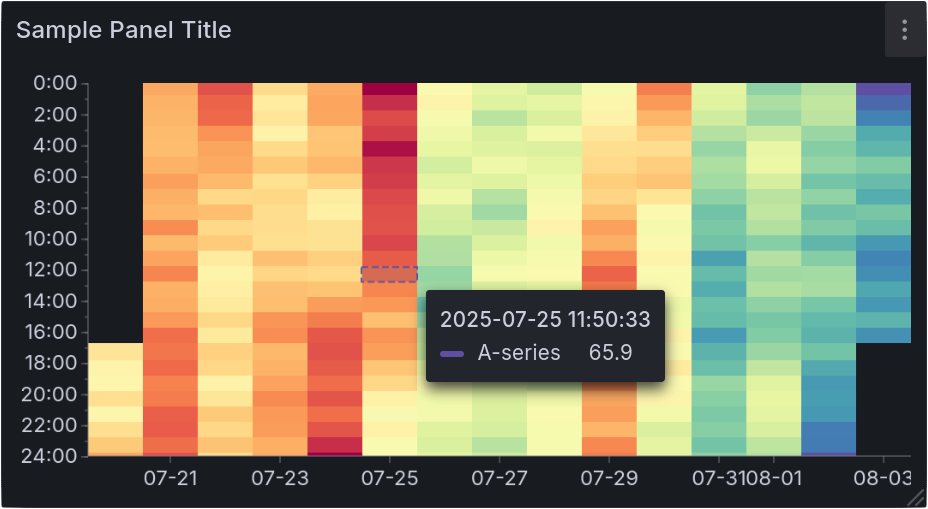

# Carpet Panel

This is a Grafana panel plugin that displays a carpet plot.
It's a spiritual successor to the Marcus Olsson's [Hourly Heatmap panel](https://grafana.com/grafana/plugins/marcusolsson-hourly-heatmap-panel/).
It is build with [Konva](https://konvajs.org/) and [react-konva](https://www.npmjs.com/package/react-konva), focusing on performance when displaying large time ranges and less uneven spacing between grid cells.

## Building

This project uses [Bun](https://bun.sh/) as a package manager and build tool together with [Rspack](https://rspack.dev/) as a bundler.
This build setup is a custom port of the Grafana plugin template which uses node and webpack.
Install dependencies with `bun install` and build with `bun run build` the output will be in `dist/`.

## Installation

Add the plugin from the `dist/` folder to your Grafana instance's `plugins` folder as `maxte-carpet-panel` and disable signature check by setting `GF_PLUGINS_ALLOW_LOADING_UNSIGNED_PLUGINS=maxte-carpet-panel` in the environment variables.

> 🚧 **Note**: This plugin is not currently available via the Grafana Plugin Repository and must be manually installed.

## Development

### Docker

Run `bun run server` to start a Grafana development server Docker container with the plugin from `dist/` and a sample dashboard;
run `bun run watch` parallelly to build the plugin on changes.

### Test page

For a simpler development test setup you can instead run `bun run devserver` which serves a small test harness mocking grafana data. This has the advantage of running React in development mode, however you will not get the full functionality of the panel.
